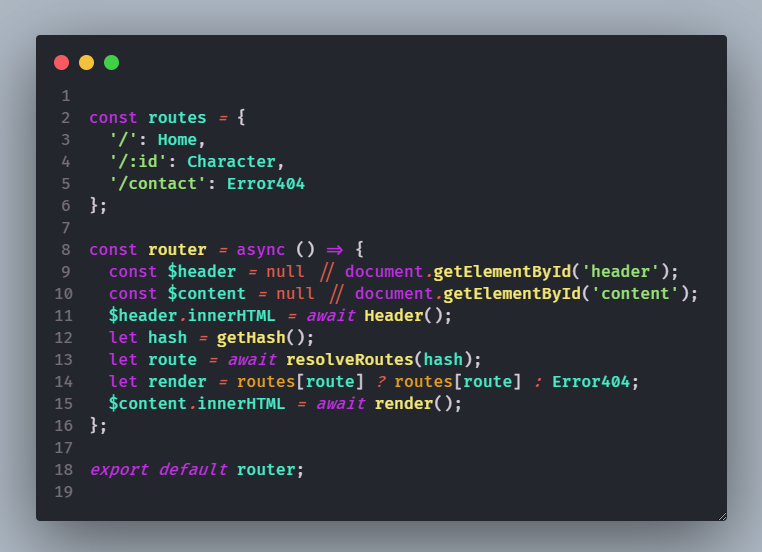

# Rick and Morty Characters

A web-app that shows all of the characters in the Rick and Morty series.
Made with JavaScript Vanilla and using Webpack as a module bundler.
Implementing Travis-ci as a continuous deployment tool.

## Installation and run local

```bash
npm install
npm run start
```

## Demo

You can view the app [here](https://dalejandro06.github.io/rickandmorty-spa/).

## Visuals


## Code examples

This is the custom router this app implements in its core, made with JavaScript.
Its simple cause the app only needs three paths, one of them get the id from location and returns the character in that math with the index.



## Contributing

Pull requests are welcome. For major changes, please open an issue first to discuss what you would like to change.

## License

[MIT](https://choosealicense.com/licenses/mit/)
